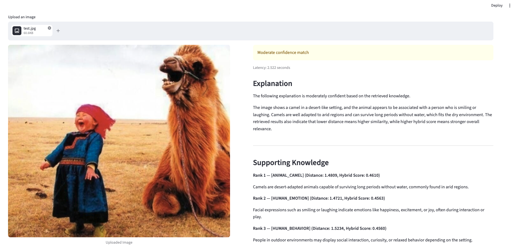

# Multimodal Image Reasoning System (RAG)

This project builds an end-to-end multimodal Retrieval-Augmented Generation (RAG) system that explains images by retrieving relevant knowledge and generating grounded, confidence-aware responses using CLIP embeddings, FAISS retrieval, and LLM reasoning.

Pipeline:
```
Image → CLIP embedding → FAISS retrieval → Hybrid re-ranking → Confidence estimation → LLM explanation
```
---

## Demo



---

## Overview

The system improves retrieval quality through hybrid semantic–lexical re-ranking and filters unreliable outputs using a confidence estimation mechanism.

Key components:
- Encode images using CLIP
- Encode knowledge base into text embeddings
- Perform nearest-neighbor search using FAISS
- Re-rank results using hybrid scoring (semantic + lexical)
- Generate grounded explanations using an LLM

The system is designed as a modular pipeline separating retrieval, ranking, and generation, allowing independent improvement of each stage.

---

## System Architecture
```
[Streamlit UI]
   ↓
[FastAPI Backend]
   ↓
[CLIP + FAISS Retrieval]
   ↓
[Hybrid Re-ranking]
   ↓
[LLM Explanation]
```
---

## Retrieval & Ranking

The system improves retrieval quality using a hybrid scoring mechanism:

- Semantic score → CLIP embedding similarity
- Lexical score → penalizes generic text and rewards unique tokens
- Final score → weighted combination

Final Score = α * Semantic + β * Lexical

This balances semantic similarity with textual specificity, reducing generic matches and improving relevance.

---

## Confidence Estimation

A confidence level is assigned based on the hybrid retrieval score:

- High → strong alignment
- Medium → partial relevance
- Low → weak retrieval

This helps avoid generating unreliable explanations.

---

## Project Structure

```
├── app.py            # Core pipeline (CLIP + FAISS + ranking + explanation)
├── api.py            # FastAPI backend
├── app_ui.py         # Streamlit frontend
├── docs/
│   └── data.txt      # Knowledge base
├── images/           # Demo assets
└── requirements.txt
```

---

## Run Locally

```
pip install -r requirements.txt

uvicorn api:app --reload

streamlit run app_ui.py
```

---

## Environment Variables
```
export OPENAI_API_KEY=your_api_key
```
---

## Key Highlights

- Hybrid retrieval with semantic + lexical re-ranking
- Confidence-aware explanation generation
- Multimodal reasoning (image + text)
- End-to-end system (UI + API + ML pipeline)
- Modular and extensible architecture

---

## Future Improvements

- Expand and refine knowledge base
- Domain-specific adaptation
- Model optimization for deployment
- Vector database integration (Pinecone, Weaviate, etc.)
- Real-time inference pipeline

---

## Author

Samarth Manjunath Hathwar