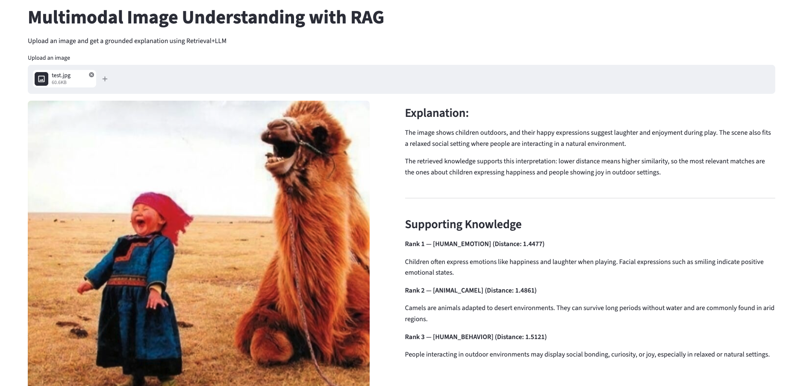

# Multimodal Image Reasoning System (RAG)

This project implements a multimodal Retrieval-Augmented Generation (RAG) system that interprets images by retrieving relevant knowledge and generating grounded explanations using CLIP embeddings, FAISS-based vector search, and an LLM.

Pipeline:
Image → Retrieve knowledge → Generate grounded explanation

---

## Demo

---

## Overview

This system combines computer vision, semantic retrieval, and language modeling to explain images using external knowledge.

It extends traditional RAG (text → text) to a multimodal setting (image → text reasoning).

Core functionality:
- Encode images using CLIP
- Encode knowledge base into text embeddings
- Perform nearest-neighbor search using FAISS
- Re-rank results using hybrid scoring (semantic + lexical)
- Generate grounded explanations using an LLM

---

## System Architecture

Frontend (Streamlit)
        ↓
Backend API (FastAPI)
        ↓
Retrieval Engine (CLIP + FAISS)
        ↓
Hybrid Re-ranking (semantic + lexical)
        ↓
LLM Explanation Generation

---

## Retrieval & Ranking

The system improves retrieval quality using a hybrid scoring mechanism:

- Semantic score → CLIP embedding similarity
- Lexical score → penalizes generic text and rewards unique tokens
- Final score → weighted combination

Final Score = α * Semantic + β * Lexical

---

## Confidence Estimation

A confidence level is assigned based on the hybrid retrieval score:

- High → strong alignment
- Medium → partial relevance
- Low → weak retrieval

This helps avoid generating unreliable explanations.

---

## Project Structure

app.py            # Core pipeline (CLIP + FAISS + ranking + explanation)
api.py            # FastAPI backend
app_ui.py         # Streamlit frontend
docs/data.txt     # Knowledge base
images/           # Demo assets
requirements.txt

---

## Run Locally

pip install -r requirements.txt

uvicorn api:app --reload

streamlit run app_ui.py

---

## Environment Variables

export OPENAI_API_KEY=your_api_key

---

## Key Highlights

- Multimodal reasoning (image + text)
- Hybrid retrieval (semantic + lexical scoring)
- Confidence-aware explanation generation
- End-to-end system (UI + API + ML pipeline)
- Modular and extensible architecture

---

## Future Improvements

- Expand and refine knowledge base
- Domain-specific adaptation
- Model optimization for deployment
- Vector database integration (Pinecone, Weaviate, etc.)
- Real-time inference pipeline

---

## Author

Samarth Manjunath Hathwar